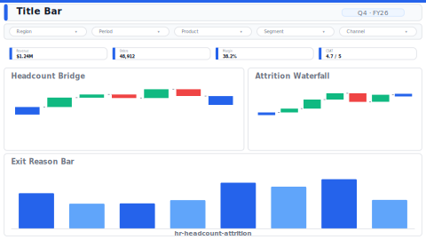

# HR Headcount & Attrition

> **Preview:**  · variants: [annotated](../../assets/layout-previews/hr-headcount-attrition-annotated.svg) · [dark](../../assets/layout-previews/hr-headcount-attrition-dark.svg)

- Canvas: `1664×936` (landscape-16x9)
- Style: `analytical` · Domain: `hr`
- Visuals: 8
- Zones: `title-bar, slicer-row, kpi-row-4, headcount-bridge, attrition-waterfall, exit-reason-bar`

## Use when
Monthly people review; headcount walk from starting to ending balance with hires/exits/transfers and attrition composition

## Avoid when
When exit-reason data is not captured or the org is < 100 employees

## Recommended themes
`hr-people-analytics`, `consulting-authority`, `microsoft-fluent`, `nord-frost`

## Chart patterns
`kpi-card-with-spark`, `waterfall`, `stacked-bar`

## Data requirements
- min_rows: 100
- required_measures: `headcount`, `hires`, `exits`
- required_dimensions: `date`, `department`
- date_grain: `month`

See `layouts-index.json` for full machine-readable entry including `zones_detail[]`.
