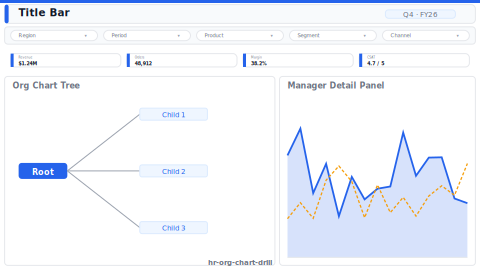

# Org Chart with Span-of-Control

> **Preview:**  · variants: [annotated](../../assets/layout-previews/hr-org-chart-drill-annotated.svg) · [dark](../../assets/layout-previews/hr-org-chart-drill-dark.svg)

- Canvas: `1664×936` (landscape-16x9)
- Style: `analytical` · Domain: `hr`
- Visuals: 5
- Zones: `title-bar, slicer-row, span-of-control-kpi, org-chart-tree, manager-detail-panel`

## Use when
Org design / span-of-control review with manager-level drill

## Avoid when
Matrix / dotted-line heavy orgs where a tree misrepresents structure

## Recommended themes
`hr-people-analytics`, `microsoft-fluent`, `consulting-authority`

## Chart patterns
`tree-visual`, `kpi-card-with-spark`, `entity-panel`

## Data requirements
- min_rows: 50
- required_measures: `reports_count`
- required_dimensions: `manager_id`, `employee_id`
- date_grain: `month`

See `layouts-index.json` for full machine-readable entry including `zones_detail[]`.
