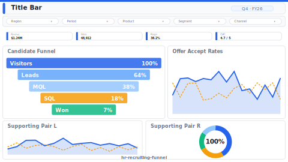

# Recruiting Funnel

> **Preview:**  · variants: [annotated](../../assets/layout-previews/hr-recruiting-funnel-annotated.svg) · [dark](../../assets/layout-previews/hr-recruiting-funnel-dark.svg)

- Canvas: `1664×936` (landscape-16x9)
- Style: `analytical` · Domain: `hr`
- Visuals: 7
- Zones: `title-bar, slicer-row, time-to-fill-kpi, candidate-funnel, offer-accept-rates, supporting-pair`

## Use when
Talent acquisition review — candidate pipeline, stage conversion, offer acceptance, time-to-fill

## Avoid when
When ATS data exports < 4 pipeline stages

## Recommended themes
`hr-people-analytics`, `brand-salesforce`, `marketing-digital`

## Chart patterns
`funnel`, `conversion-bar`, `kpi-card-with-spark`

## Data requirements
- min_rows: 200
- required_measures: `candidate_count`, `offer_accept_rate`
- required_dimensions: `stage`, `requisition`
- date_grain: `month`

See `layouts-index.json` for full machine-readable entry including `zones_detail[]`.
