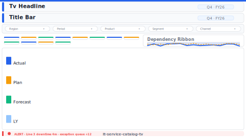

# Service Catalog Health (TV Wall 1080p)

> **Preview:**  · variants: [annotated](../../assets/layout-previews/it-service-catalog-tv-annotated.svg) · [dark](../../assets/layout-previews/it-service-catalog-tv-dark.svg)

> **Derived layout** — TV-wall variant of [`it-service-catalog`](./it-service-catalog.md).

- Canvas: `1920×1080` (tv-wall-1080p)
- Visuals: 8
- Zones: `tv-headline, title-bar, filter-bar, service-tile-grid, dependency-ribbon, service-health-legend, tv-alert-ticker`
- Use when: Always-on wall-mounted variant of `it-service-catalog`. Read-only, 1080p TV.
- Avoid when: Handheld / desktop use — TV variants use oversized type that looks wrong up close.

See the base recipe [`it-service-catalog.md`](./it-service-catalog.md) for full narrative.
