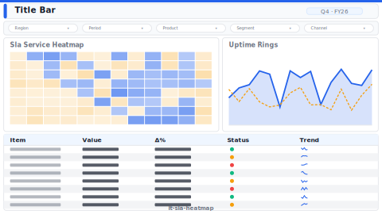

# SLA Heatmap

> **Preview:**  · variants: [annotated](../../assets/layout-previews/it-sla-heatmap-annotated.svg) · [dark](../../assets/layout-previews/it-sla-heatmap-dark.svg)

- Canvas: `1664×936` (landscape-16x9)
- Style: `operational` · Domain: `technology`
- Visuals: 7
- Zones: `title-bar, slicer-row, sla-service-heatmap, uptime-rings, sla-breach-list`

## Use when
Weekly SLA review — service × time heatmap with breach cells

## Avoid when
When SLA thresholds aren't defined per service

## Recommended themes
`tech-monitoring`, `high-contrast-dark`, `telecom-network`

## Chart patterns
`matrix-heat`, `donut-ring`, `breach-list`

## Data requirements
- min_rows: 200
- required_measures: `uptime_pct`, `sla_target`
- required_dimensions: `service`, `time_bucket`
- date_grain: `day`

See `layouts-index.json` for full machine-readable entry including `zones_detail[]`.
