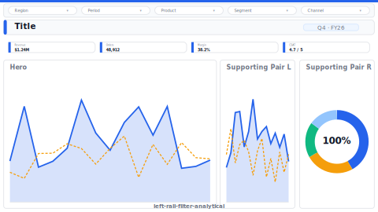

# Layout: Left-Rail Filter Analytical

> **Preview:** [](../../assets/layout-previews/left-rail-filter-analytical.svg) · variants: [annotated](../../assets/layout-previews/left-rail-filter-analytical-annotated.svg) · [dark](../../assets/layout-previews/left-rail-filter-analytical-dark.svg)

- **id:** `left-rail-filter-analytical`
- **Canvas:** 1664 × 936
- **Style personality:** Analytical
- **Audience:** Analysts, planners, ops managers who filter heavily before reading
- **Visual count:** 9 (excluding slicers in rail) — reflow-enhanced (was 7)
- **Pairs with themes:** neutral analytical; subtle accent on hero only
- **Observed in:** `references-pbip/MANUFACTURING DEMO V3.Report/` — "BC Tổng quan NVL"

---

## Zone map

```
┌─────────┬──────────────────────────────────────────────────────┐ 0
│ FILTER  │  Title + subtitle                                   │ 73
│  RAIL   ├──────────────────────────────────────────────────────┤
│ (220w)  │  KPI row (4 multi-row cards)                        │ 130
│         ├──────────────────────────────────────────────────────┤
│ Slicer1 │                                                      │
│ Slicer2 │           Hero combo chart (wide)                    │ 286
│ Slicer3 │                                                      │
│ Slicer4 │                                                      │
│ Slicer5 ├──────────────────────────────────────────────────────┤
│ Slicer6 │  Supporting chart 1  │  Supporting chart 2           │ 299
│         │                      │                               │
└─────────┴──────────────────────────────────────────────────────┘ 936
```

---

## Slot specifications

| Slot | x | y | w | h | Visual type | Notes |
|---|---|---|---|---|---|---|
| Filter rail background | 0 | 0 | 286 | 936 | shape (rect) | Subtle fill to separate from body |
| Slicer 1–6 | 16 | 94, 208, 322, 437, 551, 666 | 255 | 104 | slicer (dropdown/list) | Stack vertically in rail |
| Rail footer: reset-filters button | 16 | 863 | 255 | 52 | actionButton | "Clear filters" |
| Page title | 317 | 21 | 1326 | 42 | textbox | 22pt Semibold |
| Subtitle | 317 | 65 | 1326 | 23 | textbox | 12pt muted |
| KPI 1–4 | 317 / 650 / 983 / 1316 | 104 | 317 | 125 | multiRowCard | 12px gutter between cards |
| Hero combo chart | 317 | 244 | 1331 | 286 | lineStackedColumnComboChart | Trend + bars overlay |
| Supporting 1 | 317 | 546 | 655 | 369 | bar or column | |
| Supporting 2 | 993 | 546 | 655 | 369 | donut, matrix, or small-multiple | |

Gutters: 16px between rail and body; 12px between KPIs and between supporting pair. Multiples of 4.

---

## Navigation

Single-page analytical. If part of a multi-page report, rail's top 40px becomes a page-tab strip (actionButtons) and first slicer pushes to y=120.

---

## Theme + iconography guidance

- **Palette:** neutral; reserve one accent for the hero's line overlay. Rail background 4–6% tint of the accent.
- **Logo:** small company wordmark top-left inside rail at `(12, 12)`, max height 24px — the rail is the page chrome, logo belongs there. Leave title row logo-free.
- **Icons:** one small filter-funnel icon at the top of the rail so users recognize the zone instantly.
- **Fonts:** Segoe UI; rail slicer labels 10pt muted, values 12pt.

---

## When NOT to use this layout

- ❌ Executive audience — rail feels like a control panel, not a briefing
- ❌ Fewer than 3 slicers — rail looks empty
- ❌ Canvas narrower than 1200px — body compresses below legibility
- ❌ Mobile / tooltip contexts

---

## Customization allowed

- Collapse rail to 180px if slicers are compact single-select
- Swap hero to a full-width matrix if analysis is tabular
- Add a 2nd KPI row if more than 4 KPIs (push hero to y=200, reduce hero h to 200)

## Customization NOT allowed

- Moving the rail to the right (breaks reading order)
- Removing the rail while keeping the layout ID (that's a different layout)
- Shrinking rail below 160px (slicer labels wrap unreadably)

---

## Reflow additions (v0.6)

Six slicers are often too many — the 6th slot becomes a **narrative card** that tells the analyst what the current filter combination *means* in plain language, and a **mini-breakdown sparkline strip** above the supporting pair surfaces per-segment trends without requiring a separate drill.

### Integration

Reassign **Slicer 6** (`x=16, y=666, w=255, h=104`) to a narrative card. If 6 slicers are truly required, push the narrative to the body at `x=317, y=244, w=1331, h=32` and shrink the Hero chart by 32px top. Mini-breakdown strip reclaims a 32h band above the supporting pair.

### New slots

| Slot | x | y | w | h | Visual type | Notes |
|---|---|---|---|---|---|---|
| Narrative context card | 16 | 666 | 255 | 104 | multiRowCard | Replaces Slicer 6; reads current filter state + dominant measure in sentence form |
| Mini-breakdown strip | 317 | 530 | 1331 | 16 | lineChart × 5 (sparkline-mini) | Per-segment sparks above the supporting pair; reduces Supporting charts h to 353 |

