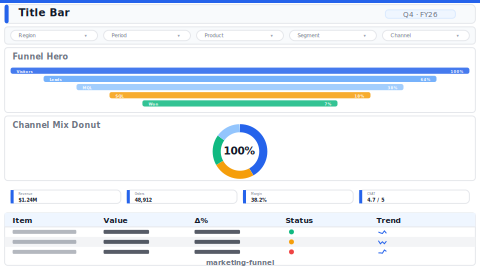

# Layout: Marketing Funnel & Attribution

> **Preview:** [](../../assets/layout-previews/marketing-funnel.svg) · variants: [annotated](../../assets/layout-previews/marketing-funnel-annotated.svg) · [dark](../../assets/layout-previews/marketing-funnel-dark.svg)

- **id:** `marketing-funnel`
- **Canvas:** 1664 × 936
- **Style personality:** Analytical
- **Audience:** Marketing managers, growth analysts, digital leads
- **Visual count:** 7
- **Pairs with themes:** vibrant analytical; channel colors consistent across page

## Zone map

```
┌────────────────────────────────────────────────────────────────┐ 0
│ Title bar: "Acquisition funnel — {Period}"                    │ 56
├────────────────────────────────────────────────────────────────┤
│ Campaign slicer row (Campaign · Channel · Region · Segment)   │ 40
├────────────────────────────────────────────────────────────────┤
│                                   │                           │
│      FUNNEL HERO                  │   Channel mix donut       │ 360
│   (Impr → Click → Lead →          │   + side legend           │
│    MQL → SQL → Closed Won)        │                           │
├────────────────────────────────────────────────────────────────┤
│ ┌──CVR──┐ ┌──CPA──┐ ┌──ROAS─┐ ┌──MQL→SQL─┐                    │ 120
│ └───────┘ └───────┘ └───────┘ └──────────┘                    │
├────────────────────────────────────────────────────────────────┤
│ Attribution table (channel × touchpoint × revenue)            │ 220
└────────────────────────────────────────────────────────────────┘ 936
```

## Slot specifications

| Slot | x | y | w | h | Visual type | Notes |
|---|---|---|---|---|---|---|
| Title bar | 32 | 16 | 1600 | 56 | textbox | Include period in title |
| Campaign slicer | 32 | 80 | 1600 | 40 | slicer × 4 | Campaign, Channel, Region, Segment |
| Funnel hero | 32 | 136 | 1040 | 360 | funnel / bar | Show count + CVR% between stages |
| Channel mix donut | 1088 | 136 | 544 | 360 | donut | Center label = dominant channel |
| KPI: CVR | 32 | 512 | 384 | 120 | card | Conversion rate |
| KPI: CPA | 432 | 512 | 384 | 120 | card | Cost per acquisition |
| KPI: ROAS | 832 | 512 | 384 | 120 | card | Return on ad spend |
| KPI: MQL→SQL | 1232 | 512 | 400 | 120 | card | Mid-funnel velocity |
| Attribution table | 32 | 648 | 1600 | 264 | matrix | Channel × touchpoint × revenue, data bars on revenue |

## Theme + iconography guidance

- **Channel palette**: stable mapping (Paid Search = blue, Organic = green, Social = orange, etc.) — apply in theme `dataColors` so donut/funnel/table agree
- **Logo:** company wordmark top-left of title bar at `(32, 24)`, max height 28px. Do NOT use channel partner logos inside the donut — show their name in the legend only (avoid trademark misuse).
- **Icons on KPIs**: funnel, dollar, megaphone, arrow-right
- Use data bars (not heat background) on attribution revenue column

## When NOT to use this layout

- ❌ Brand-awareness only campaigns (no conversion funnel yet) — use trend + reach card
- ❌ Single-channel deep dive — use `sales-performance` with channel filter instead
- ❌ Creative asset library — not a reporting page (use SharePoint)
