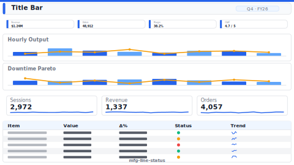

# Layout: Manufacturing Line Status (OEE)

> **Preview:** [](../../assets/layout-previews/mfg-line-status.svg) · variants: [annotated](../../assets/layout-previews/mfg-line-status-annotated.svg) · [dark](../../assets/layout-previews/mfg-line-status-dark.svg)

- **id:** `mfg-line-status`
- **Canvas:** 1920 × 1080 (shop-floor display) OR 1664 × 936 (desktop)
- **Style personality:** Operational (see `../executor-operational.md`)
- **Audience:** Production supervisors, line operators, plant manager
- **Visual count:** 10 (line-level OEE detail)

---

## Zone map (1664 × 936 variant)

```
┌────────────────────────────────────────────────────────────────┐ 0
│  LINE A-3 — Shift 2         [Last refresh: 14:22]  [● RUNNING]│ 64
├────────────────────────────────────────────────────────────────┤
│  ┌──────────┐ ┌──────────┐ ┌──────────┐ ┌──────────┐           │
│  │   OEE    │ │Availability│ │Performance│ │ Quality  │         │ 152
│  │  82.3%   │ │  94.1%   │ │  91.2%   │ │  96.0%   │           │
│  │  (48pt)  │ │          │ │          │ │          │           │
│  └──────────┘ └──────────┘ └──────────┘ └──────────┘           │
├────────────────────────────────────────────────────────────────┤ 232
│  ┌──────────────────────────────┐ ┌──────────────────────────┐ │
│  │  Hourly output (bars)        │ │ Downtime Pareto (bars)   │ │ 280
│  │  + target line               │ │ top-N reason codes       │ │
│  └──────────────────────────────┘ └──────────────────────────┘ │
├────────────────────────────────────────────────────────────────┤ 520
│  ┌─────────────────┐ ┌─────────────────┐ ┌─────────────────┐  │
│  │ Scrap % trend   │ │ Speed trend     │ │ First-pass yield│  │ 200
│  │ (spark)         │ │ (spark)         │ │ (spark)         │  │
│  └─────────────────┘ └─────────────────┘ └─────────────────┘  │
├────────────────────────────────────────────────────────────────┤ 728
│  Current Work Orders table (WO# / product / target / actual / status)│ 208
└────────────────────────────────────────────────────────────────┘ 936
```

---

## Slot specifications

| Slot | x | y | w | h | Visual type | Notes |
|---|---|---|---|---|---|---|
| Page title | 32 | 16 | 1200 | 48 | textbox | Line + shift (dynamic from slicer or URL param) |
| Refresh + status | 1248 | 24 | 384 | 32 | card group | Live indicator mandatory |
| OEE card | 32 | 80 | 392 | 136 | card | 48pt, threshold-colored (`bad` < 65, `neutral` 65-80, `good` > 80) |
| Availability / Perf / Quality | 440+(i×400) | 80 | 392 | 136 | card | Same threshold logic |
| Hourly output | 32 | 248 | 808 | 256 | clusteredColumnChart | Reference line = target throughput |
| Downtime Pareto | 856 | 248 | 776 | 256 | clusteredBarChart | Sorted DESC, top-N reason codes |
| Trend 1-3 (scrap/speed/yield) | 32+(i×536) | 520 | 520 | 184 | lineChart | Sparkline-style, shared axis |
| Work orders table | 32 | 720 | 1600 | 200 | tableEx | Conditional format `status` column |

---

## Navigation

- NOT interactive — shop-floor display is read-only
- If accessed from a plant overview, drillthrough field = Line ID
- No slicers except an optional Shift picker (top-right) on desktop variant

---

## Theme + iconography guidance

- **Palette:** dark industrial — dark background2, high-contrast `good` (green) / `bad` (red) / `neutral` (amber) tokens
- **Logo:** plant + line badge top-left at `(32, 16)`, 40px tall — must be readable from ≥ 5m. Corporate logo optional, top-right small. Include line-ID chip next to the logo so operators instantly recognize the board.
- **Icons:** status icons on every KPI and on work-order rows
- **Fonts:** 48pt OEE value, 32pt other KPI values, 14pt minimum everywhere else
- **Reference lines:** target throughput on hourly chart in `neutral` dashed line

---

## When NOT to use this layout

- ❌ Plant or corporate overview (use `ops-single-screen` with multi-line summary)
- ❌ Historical OEE analysis (use `sales-performance`-style analytical page with time slicer)
- ❌ Non-discrete manufacturing (process plants need flow rates, not unit counts)

---

## Data quality gotchas

- **OEE formula:** Availability × Performance × Quality — all three inputs must be on the same time window
- **Target line** on hourly output is shift-dependent; ensure the target changes when shift changes
- **Downtime code completeness:** operators sometimes leave downtime uncoded — render uncoded as `neutral` and separate from real reasons
- **Work-order status:** use an enum `Running / Setup / Down / Complete`, not free text
