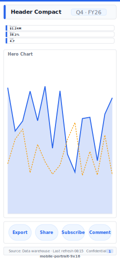

# Layout: Mobile Portrait (Power BI mobile layout)

> **Preview:** [](../../assets/layout-previews/mobile-portrait-9x16.svg) · variants: [annotated](../../assets/layout-previews/mobile-portrait-9x16-annotated.svg) · [dark](../../assets/layout-previews/mobile-portrait-9x16-dark.svg)

- **id:** `mobile-portrait-9x16`
- **Canvas:** 390 × 844 (Power BI phone-optimized canvas; iPhone-scale reference)
- **Style personality:** Operational — thumb-accessible, glanceable
- **Audience:** Field staff, on-the-go executives, mobile-first users
- **Visual count:** 5
- **Pairs with themes:** must stay readable at small size; avoid complex visuals

## Zone map

```
┌───────────────────────┐ 0
│ Compact header        │ 56
│ (logo + title + menu) │
├───────────────────────┤
│  ┌─KPI 1─┐            │
│  └───────┘            │ 264
│  ┌─KPI 2─┐            │
│  └───────┘            │
│  ┌─KPI 3─┐            │
│  └───────┘            │
├───────────────────────┤
│                       │
│   HERO chart          │ 340
│   (trend or bar)      │
│                       │
├───────────────────────┤
│  Quick-action row     │ 60
│  (3 buttons)          │
├───────────────────────┤
│  Footer nav bar       │ 64
│  (Home / Reports /    │
│   Alerts / Profile)   │
└───────────────────────┘ 844
```

## Slot specifications

| Slot | x | y | w | h | Visual type | Notes |
|---|---|---|---|---|---|---|
| Header | 0 | 0 | 390 | 56 | image + textbox | Logo 24px, title 14pt Semibold, hamburger right |
| KPI 1 | 16 | 72 | 358 | 80 | card | Big number + label + status dot |
| KPI 2 | 16 | 160 | 358 | 80 | card | |
| KPI 3 | 16 | 248 | 358 | 80 | card | |
| Hero chart | 16 | 344 | 358 | 340 | line or bar | Minimal ticks; no legend if one series |
| Quick-action row | 16 | 696 | 358 | 60 | buttons × 3 | Page-navigation buttons |
| Footer nav | 0 | 780 | 390 | 64 | buttons × 4 | Sticky nav; use icons + tiny labels |

## Authoring notes

1. This is a **separate canvas** in Power BI Desktop — View → Mobile layout, then drag-drop visuals from the desktop canvas. Don't create a new report page — use the same page's mobile layout slot.
2. Only visuals placed on the mobile layout appear in Power BI mobile apps in portrait mode.
3. Target tap area ≥ 44×44px for any interactive element.
4. Legends, axis titles, and data labels mostly go — use data-only visuals.

## Theme + iconography guidance

- **Palette**: 1 accent; high contrast
- **Logo**: square/monogram mark (not wordmark) top-left of header at `(16, 16)`, 24px — wordmarks are too small to read on mobile. Title text right of the logo. Hamburger menu pins right edge.
- **Icons**: tabler-outline icons at 24px for quick-actions and footer
- **Fonts**: Segoe UI 14pt body minimum; values 20–24pt

## When NOT to use this layout

- ❌ Desktop-only report (mobile layout optional)
- ❌ Landscape phone use (Power BI mobile auto-rotates to the desktop layout instead)
- ❌ Complex matrix / table — phone users can't scan > 3 columns comfortably
