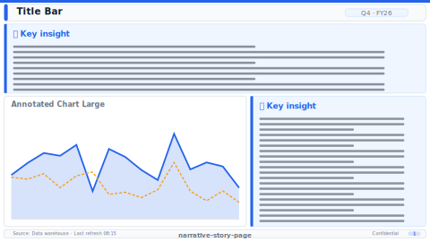

# Narrative Story Page

> **Preview:**  · variants: [annotated](../../assets/layout-previews/narrative-story-page-annotated.svg) · [dark](../../assets/layout-previews/narrative-story-page-dark.svg)

- Canvas: `1664×936` (landscape-16x9)
- Style: `executive` · Domain: `cross-domain`
- Visuals: 5
- Zones: `title-bar, narrative-text-panel, annotated-chart-large, insight-callouts, footer`

## Use when
Text-heavy insight narrative — scrollytelling style with annotated chart and pull-quotes

## Avoid when
Operational audiences expecting dense KPI grids

## Recommended themes
`consulting-authority`, `brand-stripe`, `media-entertainment`, `sustainability-esg`

## Chart patterns
`annotated-chart`, `callout-text`, `pull-quote`

## Data requirements
- min_rows: 12
- required_measures: `primary_metric`
- required_dimensions: `date`
- date_grain: `month`

See `layouts-index.json` for full machine-readable entry including `zones_detail[]`.
