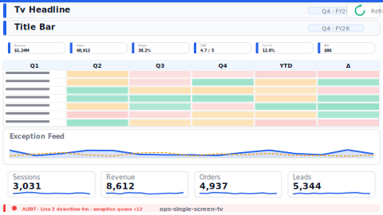

# Operational Single-Screen Status Board (TV Wall 1080p)

> **Preview:**  · variants: [annotated](../../assets/layout-previews/ops-single-screen-tv-annotated.svg) · [dark](../../assets/layout-previews/ops-single-screen-tv-dark.svg)

> **Derived layout** — TV-wall variant of [`ops-single-screen`](./ops-single-screen.md).

- Canvas: `1920×1080` (tv-wall-1080p)
- Visuals: 14
- Zones: `tv-headline, title-bar, refresh-indicator, kpi-strip-6, status-matrix, exception-feed, sparkline-row-4, tv-alert-ticker`
- Use when: Always-on wall-mounted variant of `ops-single-screen`. Read-only, 1080p TV.
- Avoid when: Handheld / desktop use — TV variants use oversized type that looks wrong up close.

See the base recipe [`ops-single-screen.md`](./ops-single-screen.md) for the full narrative. This variant inherits intent and data requirements; it differs only in canvas, zone stacking, and visual density. Recommended themes, interaction model, and data requirements are documented in `layouts-index.json` under `id: ops-single-screen-tv`.
