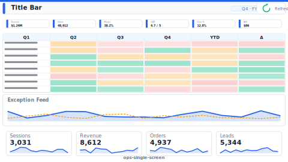

# Layout: Operational Single-Screen Status Board

> **Preview:** [](../../assets/layout-previews/ops-single-screen.svg) · variants: [annotated](../../assets/layout-previews/ops-single-screen-annotated.svg) · [dark](../../assets/layout-previews/ops-single-screen-dark.svg)

- **id:** `ops-single-screen`
- **Canvas:** 1920 × 1080 (wall-mount TV) OR 1664 × 936 (desktop)
- **Style personality:** Operational (see `../executor-operational.md`)
- **Audience:** Line supervisors, control-room operators, NOC
- **Visual count:** 10-12 (dense, status-driven)
- **Refresh:** < 5 minutes (timestamp mandatory)

---

## Zone map (1664 × 936 variant)

```
┌────────────────────────────────────────────────────────────────┐ 0
│  TITLE (32pt)         [Last refresh: 09:14:22]  [● LIVE]      │ 64
├────────────────────────────────────────────────────────────────┤
│  ┌──────┐┌──────┐┌──────┐┌──────┐┌──────┐┌──────┐              │
│  │ KPI1 ││ KPI2 ││ KPI3 ││ KPI4 ││ KPI5 ││ KPI6 │             │ 152
│  │ 48pt ││      ││      ││      ││      ││      │  (status   │
│  └──────┘└──────┘└──────┘└──────┘└──────┘└──────┘   strip)    │
├────────────────────────────────────────────────────────────────┤ 232
│  ┌────────────────────────────────┐ ┌─────────────────────┐    │
│  │  STATUS MATRIX (entities × KPI)│ │ EXCEPTION FEED      │   │
│  │  traffic-light cells           │ │ (scrolling list of  │   │ 440
│  │                                │ │ alerts w/ timestamp)│   │
│  └────────────────────────────────┘ └─────────────────────┘    │
├────────────────────────────────────────────────────────────────┤ 680
│  ┌─────────┐ ┌─────────┐ ┌─────────┐ ┌─────────┐               │
│  │ Trend 1 │ │ Trend 2 │ │ Trend 3 │ │ Trend 4 │              │ 240
│  │ sparkln │ │ sparkln │ │ sparkln │ │ sparkln │              │
│  └─────────┘ └─────────┘ └─────────┘ └─────────┘               │
└────────────────────────────────────────────────────────────────┘ 936
```

---

## Slot specifications

| Slot | x | y | w | h | Visual type | Notes |
|---|---|---|---|---|---|---|
| Page title | 32 | 16 | 1200 | 48 | textbox | 32pt Semibold, site/line name |
| Refresh timestamp | 1232 | 24 | 280 | 32 | textbox | Dynamic M-driven text; update ≤ 5 min |
| Live indicator | 1528 | 24 | 104 | 32 | card | Pulsing `good` dot if fresh, `bad` if stale |
| KPI 1-6 | 32+(i×272) | 80 | 256 | 136 | card | 48pt value, threshold-colored |
| Status matrix | 32 | 232 | 1000 | 440 | pivotTable | `chart-templates/matrix-scorecard.md` |
| Exception feed | 1048 | 232 | 584 | 440 | tableEx | Sort DESC by timestamp |
| Trend 1-4 | 32+(i×408) | 688 | 392 | 232 | lineChart | Sparkline-style; shared Y axis |

Gutters: 16px everywhere. All slots multiples of 8.

---

## Navigation

None — operational boards are standalone. If drill is needed, use double-click behaviors, not buttons. No cross-filter (operators read, don't query).

---

## Theme + iconography guidance

- **Palette:** dark background (background2 dark) + high-contrast `good` / `bad` / `neutral` tokens
- **Logo:** site / plant logo top-left at `(32, 16)`, 32–40px tall — readable from 3m. Pair with plant/shift label right of it. Skip secondary corporate mark — the wall board context is local.
- **Icons:** mandatory status icons on every KPI (●, ▲, ▼)
- **Fonts:** Segoe UI, **48pt** KPI values, **16pt** table cells, no text below 14pt

---

## When NOT to use this layout

- ❌ Executive summary (too dense, too technical)
- ❌ Interactive analytical exploration (users can't drill a wall board)
- ❌ Single-KPI focus (use a card-only kiosk layout)
- ❌ Audience views on phone (operational boards are fixed-display)

---

## Data quality gotchas

- **Staleness:** if refresh > 5 min, flip live indicator to `bad` — operators must see data is old
- **Blank cells** in status matrix must render as `neutral`, not `good` (never signal OK when unknown)
- **Exception feed:** cap at last 50 events; older events belong in a history page
