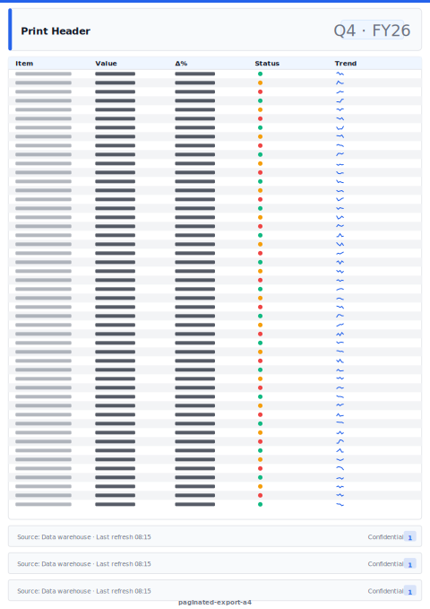

# Paginated Export (A4 Portrait)

> **Preview:**  · variants: [annotated](../../assets/layout-previews/paginated-export-a4-annotated.svg) · [dark](../../assets/layout-previews/paginated-export-a4-dark.svg)

- Canvas: `827×1169` (print-a4)
- Style: `analytical` · Domain: `cross-domain`
- Visuals: 3
- Zones: `print-header, paginated-table, paginated-subtotal-row, page-break-rule, print-footer-page-number`

## Use when
Tabular report tuned for paginated / PDF export; A4 portrait

## Avoid when
Interactive digital viewing — use detail-grid layouts instead

## Recommended themes
`corporate-financial`, `consulting-authority`, `public-sector-gov`, `brand-ibm-carbon`

## Chart patterns
`paginated-table`, `subtotal-row`

## Data requirements
- min_rows: 50
- required_measures: `amount`
- required_dimensions: `category`
- date_grain: `any`

See `layouts-index.json` for full machine-readable entry including `zones_detail[]`.
