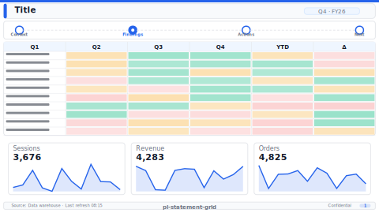

# Layout: P&L Statement Grid

> **Preview:** [](../../assets/layout-previews/pl-statement-grid.svg) · variants: [annotated](../../assets/layout-previews/pl-statement-grid-annotated.svg) · [dark](../../assets/layout-previews/pl-statement-grid-dark.svg)

- **id:** `pl-statement-grid`
- **Canvas:** 1664 × 936
- **Style personality:** Analytical — dense, table-of-numbers feel without being a plain matrix
- **Audience:** Controllers, accountants, audit prep, financial statement readers
- **Visual count:** 22 logical slots (≈40–50 rendered cells when the grid is fully populated; single PBIR page) — reflow-enhanced (was 20)
- **Pairs with themes:** neutral / paper; 1 semantic colour for negative numbers only
- **Observed in:** `references-pbip/PL_Report_Demo - V3.Report/` — "P&L"

---

## Zone map

```
┌────────────────────────────────────────────────────────────────┐ 0
│ Title + period + company                                      │ 73
├─────────┬──────────────────────────────────────────────────────┤
│         │  Col hdr: Actual · Plan · Δ · YoY · Sparkline       │ 42
│ Section ├──────────────────────────────────────────────────────┤
│ markers │                                                      │
│ (arrow  │   Revenue           $       $       $%      $%  ▁▂▄ │
│ shapes) │     Product A       …       …       …       …   ▂▄▆ │
│ vertical│     Product B       …       …       …       …   ▃▅▂ │ 634
│ down    │     Product C       …       …       …       …   ▁▄▆ │
│ left    │   Gross Profit      …       …       …       …   ▂▃▅ │
│ side    │   Opex              …       …       …       …   ▁▃▂ │
│         │   Operating Income  …       …       …       …   ▃▄▅ │
├─────────┴──────────────────────────────────────────────────────┤
│ Footnote: "Values in {currency}. Consolidated, GAAP."         │ 31
└────────────────────────────────────────────────────────────────┘ 936
```

---

## Slot specifications

| Slot | x | y | w | h | Visual type | Notes |
|---|---|---|---|---|---|---|
| Title | 31 | 21 | 780 | 42 | textbox | Company name + "P&L" |
| Period strip | 832 | 21 | 801 | 42 | textbox | "YTD Mar 2026 · Consolidated" right-aligned |
| Section marker — Revenue | 0 | 125 | 114 | 52 | arrowPentagonShape | Labels the section on the page gutter |
| Section marker — Gross Profit | 0 | 437 | 114 | 52 | arrowPentagonShape | |
| Section marker — Operating Income | 0 | 676 | 114 | 52 | arrowPentagonShape | |
| Column headers | 125 | 94 | 1508 | 31 | textbox (×5) | "Actual", "Plan", "Δ $", "Δ %", "YoY trend" |
| Line cells (value, plan, Δ, YoY) | 96…1020 | 100…600 | 220×4 | 36 per row | card | ≈ 10 rows × 4 metric columns |
| Sparkline cells | 1024 | 100…600 | 228 | 36 per row | lineChart (mini) | One sparkline per row |
| Footnote | 31 | 884 | 1602 | 31 | textbox | Methodology / scope |

Row heights are uniform (36px) so rows align horizontally across columns. Gutter 8px inside the grid, 16px between sections.

---

## Navigation

- Drillthrough target by default: right-click on any line row → "Drillthrough to transactions".
- Sections are visual only (arrow shapes in the gutter); they are not bookmarks.

---

## Theme + iconography guidance

- **Palette:** monochrome body; ONE colour for negative values / unfavourable variance. Subtotal rows bold + 1px top border (`shape` line, not `divider`).
- **Logo:** company wordmark top-left of the title at `(24, 16)` max height 24px; shift title text to x=76. Financial statements are formal documents — logo is expected.
- **Icons:** none inside the grid (keeps it "statement-like"); section arrow shapes carry all wayfinding.
- **Fonts:** values use tabular/lining numerals (Segoe UI Semibold 12pt); labels 11pt. Subtotals 13pt Semibold.

---

## When NOT to use this layout

- ❌ Audience is non-finance — the dense layout looks intimidating
- ❌ Need to compare > 5 periods side-by-side — the column widths compress below readability
- ❌ Visual discovery / exploratory analysis (use `variance-dual-waterfall` or `kpi-donut-row`)

---

## Customization allowed

- Replace the 5-column metric block with (Actual / Prior year / Δ %) three-column condensed form
- Add a sixth column for a "% of revenue" ratio
- Extend to a second page ("Balance Sheet") with the same primitive composition

## Customization NOT allowed

- Replacing cards with a single `pivotTable` — defeats the pixel-crafted statement look
- Removing sparklines — the row-level trend is the only "chart-like" signal this layout offers
- Introducing background fills on alternating rows (competes with the subtotal borders)

---

## Reflow additions (v0.6)

The dense statement grid has no headline commentary. Reclaim the strip between the title and the column headers for a **one-line YTD summary** (direction + magnitude), and split the right-edge sparkline column into **trend + bucket-variance mini-bar** columns so readers see *where* the variance concentrates, not just that there was one.

### Integration

Narrow **Sparkline cells** from `w=228` to `w=140`, add a `88w` variance mini-bar at the row's right edge. The commentary strip uses the currently empty band above column headers.

### New slots

| Slot | x | y | w | h | Visual type | Notes |
|---|---|---|---|---|---|---|
| YTD commentary strip | 125 | 73 | 1508 | 21 | textbox | One-liner: "YTD vs Plan +3.4%; Opex headwind in Q2"; muted 11pt |
| Variance mini-bar col | 1164 | 100 | 88 | 36 | barChart (mini) × N rows | Horizontal bar per line, diverging around 0% |

