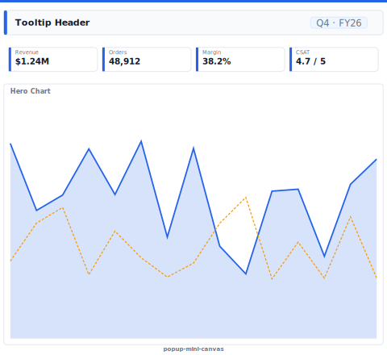

# Layout: Popup Mini-Canvas

> **Preview:** [](../../assets/layout-previews/popup-mini-canvas.svg) · variants: [annotated](../../assets/layout-previews/popup-mini-canvas-annotated.svg) · [dark](../../assets/layout-previews/popup-mini-canvas-dark.svg)

- **id:** `popup-mini-canvas`
- **Canvas:** 600 × 550
- **Style personality:** Executive — Compact 600×550 canvas with mini KPI strip + one primary chart — embeddable in Teams / intranet
- **Audience:** Quick-view consumers — executives who want a TL;DR without opening the full report
- **Visual count:** 5
- **Pairs with themes:** neutral body with one accent — pattern designed to read on any corporate palette.
- **Observed in:** `references-pbip/Sales Analysis Demo (V.GF).Report/` — 'Quick View Daily Sales' (600×550)

---

## Zone map

```
┌─────────────────────────────────┐ 0
│ Title + period                  │ 44
├─────────────┬─────────────┬─────┤
│ KPI 1       │ KPI 2       │ KPI3│ 80
├─────────────┴─────────────┴─────┤
│                                 │
│                                 │
│   PRIMARY CHART (line / bars)   │ 360
│                                 │
│                                 │
├─────────────────────────────────┤
│ Footer: last-refresh            │ 26
└─────────────────────────────────┘
```

---

## Slot specifications

| Slot | x | y | w | h | Visual type | Notes |
|---|---|---|---|---|---|---|
| Header | 0 | 0 | 600 | 44 | shape + textbox + slicer(Period) | Title + period |
| KPI card 1 | 8 | 52 | 192 | 80 | card | Primary metric |
| KPI card 2 | 204 | 52 | 192 | 80 | card | Comparison metric |
| KPI card 3 | 400 | 52 | 192 | 80 | card | Delta / mix |
| Primary chart | 8 | 140 | 584 | 370 | lineChart or clusteredColumnChart | One chart — no secondary viz |
| Footer | 0 | 524 | 600 | 26 | textbox | Last refresh stamp |

Gutters: 16px between primary zones; 8px inside KPI card rows.

---

## Navigation

- Reachable from the report's top-nav chiclet strip or landing page. Include a small 'Home' actionButton in the header when not the landing page.
- Cross-links out to related drillthrough / detail pages should be surfaced via card-level actions, not a separate nav rail.

---

## Theme + iconography guidance

- **Palette:** Single accent across all KPIs + chart series. No competing colours.
- **Logo:** Top-left at (8, 10) max height 20px. Optional.
- **Icons:** Max 1 glyph per KPI card.
- **Fonts:** Header 14pt Semibold, KPI value 20pt, chart axis 8pt.

---

## When NOT to use this layout

- ❌ Page will be viewed standalone in Power BI Service — use full 1664×936 `exec-overview-16x9`
- ❌ Audience needs drillthrough — popup has no room for navigation chrome
- ❌ More than 3 KPIs needed — switch canvas to 1664×936

---

## Customization allowed

- Change canvas to 800×500 for wider embeds
- Swap the primary chart for a small matrix (≤ 5 rows)

## Customization NOT allowed

- Adding page navigation buttons (popup has no nav context)
- Embedding a second chart — loses the 'one-glance' pattern
