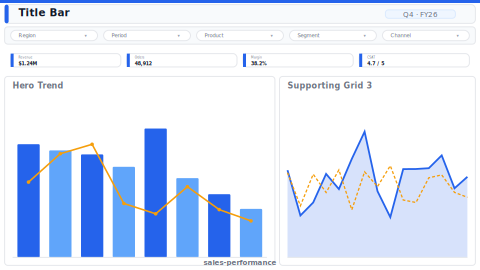

# Layout: Sales Performance

> **Preview:** [](../../assets/layout-previews/sales-performance.svg) · variants: [annotated](../../assets/layout-previews/sales-performance-annotated.svg) · [dark](../../assets/layout-previews/sales-performance-dark.svg)

- **id:** `sales-performance`
- **Canvas:** 1664 × 936
- **Style personality:** Analytical (see `../executor-analytical.md`)
- **Audience:** sales managers, regional directors, BI analysts
- **Visual count:** 7 (excluding slicers)
- **Pairs with themes:** any analytical theme; brand accent on hero

---

## Zone map

```
┌────────────────────────────────────────────────────────────────┐ 0
│ Title + subtitle                                               │ 56
├────────────────────────────────────────────────────────────────┤
│ [Slicer 1] [Slicer 2] [Slicer 3] [Slicer 4]  [Clear button]   │ 104
├────────────────────────────────────────────────────────────────┤
│ [KPI 1][KPI 2][KPI 3][KPI 4][KPI 5]                           │ 224
├────────────────────────────────────────────────────────────────┤
│                                                                │
│   HERO — revenue trend with target reference line              │ 544
│                                                                │
├────────────────────────────────────────────────────────────────┤
│  ┌────────┐  ┌────────┐  ┌────────┐                           │
│  │Region  │  │Product │  │Channel │                           │ 824
│  │breakdn │  │breakdn │  │breakdn │                           │
│  └────────┘  └────────┘  └────────┘                           │
└────────────────────────────────────────────────────────────────┘ 936
```

---

## Slot specifications

| Slot | x | y | w | h | Visual type | Chart template |
|---|---|---|---|---|---|---|
| Page title | 16 | 8 | 1632 | 48 | textbox | — |
| Slicer: period | 16 | 64 | 320 | 40 | slicer | — |
| Slicer: region | 344 | 64 | 320 | 40 | slicer | — |
| Slicer: product category | 672 | 64 | 320 | 40 | slicer | — |
| Slicer: channel | 1000 | 64 | 320 | 40 | slicer | — |
| Clear-all button | 1336 | 64 | 312 | 40 | button | — |
| KPI 1: Total revenue | 16 | 112 | 320 | 104 | card | `kpi-banner.md` |
| KPI 2: YoY % | 344 | 112 | 320 | 104 | card | `kpi-banner.md` |
| KPI 3: vs Plan % | 672 | 112 | 320 | 104 | card | `kpi-banner.md` |
| KPI 4: Avg deal size | 1000 | 112 | 320 | 104 | card | `kpi-banner.md` |
| KPI 5: Win rate | 1328 | 112 | 320 | 104 | card | `kpi-banner.md` |
| Hero: revenue trend | 16 | 224 | 1632 | 320 | line | `trend-line.md` |
| Region breakdown | 16 | 552 | 536 | 384 | bar | `bar-comparison.md` |
| Product breakdown | 560 | 552 | 536 | 384 | bar | `bar-comparison.md` |
| Channel breakdown | 1104 | 552 | 544 | 384 | bar OR donut | `bar-comparison.md` |

Gutters: 8px between slicers / KPIs / grid visuals, 8px between zones. All multiples of 8.

---

## Navigation

- Page header: include page navigator OR button bar (Design Spec §8)
- Drillthrough: right-click any region/product/channel bar → drillthrough detail page
- Tooltip pages: optional on hero + supporting grid

---

## Sync slicers

All 4 slicers sync across this page and any other Analytical pages in the report (use `syncGroups` in Design Spec §8).

---

## Theme + iconography guidance

- **Palette:** monochromatic with one brand accent; neutral for non-focal bars
- **Logo:** company wordmark top-left of title bar at `(32, 24)`, max height 28px; page title shifts right when present. Entity / business-unit logo (if any) goes top-right of the same bar, ≤ 24px.
- **Icons:** KPI-set (trend arrows, target) on each card
- **Data labels:** ON for KPIs and bar charts; off for line chart (use markers + endpoint labels)

---

## When NOT to use this layout

- ❌ Executive audience — too dense
- ❌ Ops monitoring — not enough status encoding
- ❌ P&L / finance reporting (use finance-pnl-waterfall layout — backlog)
- ❌ Reports without clear categorical dimensions (region/product/channel)

---

## Customization allowed

- Swap supporting-grid 3rd visual to donut when channel has ≤ 5 segments
- Replace hero line chart with combo (line+bar) if plan visualization needed
- Add a 4th row of small-multiples below (reduce supporting-grid to 280h)

## Customization NOT allowed

- Removing slicer row (core to Analytical style)
- KPI count < 4 or > 6
- More than 8 total visuals (cross into Operational territory — use that layout)
