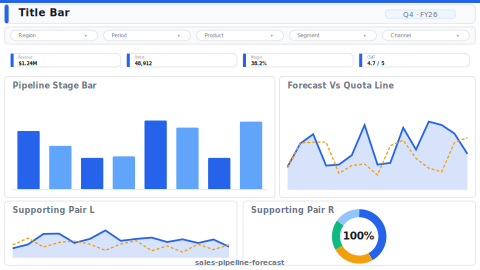

# Pipeline Forecast

> **Preview:**  · variants: [annotated](../../assets/layout-previews/sales-pipeline-forecast-annotated.svg) · [dark](../../assets/layout-previews/sales-pipeline-forecast-dark.svg)

- Canvas: `1664×936` (landscape-16x9)
- Style: `analytical` · Domain: `sales`
- Visuals: 8
- Zones: `title-bar, slicer-row, velocity-kpis, pipeline-stage-bar, forecast-vs-quota-line, supporting-pair`

## Use when
Weekly pipeline forecast — weighted stage-value, velocity, forecast vs quota

## Avoid when
Transactional / e-commerce models without multi-stage pipelines

## Recommended themes
`sales-growth`, `brand-salesforce`, `corporate-financial`

## Chart patterns
`stacked-bar`, `line-yoy`, `kpi-card-with-spark`

## Data requirements
- min_rows: 200
- required_measures: `weighted_value`, `quota`
- required_dimensions: `stage`, `rep`
- date_grain: `week`

See `layouts-index.json` for full machine-readable entry including `zones_detail[]`.
