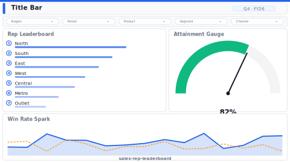

# Rep Leaderboard

> **Preview:**  · variants: [annotated](../../assets/layout-previews/sales-rep-leaderboard-annotated.svg) · [dark](../../assets/layout-previews/sales-rep-leaderboard-dark.svg)

- Canvas: `1664×936` (landscape-16x9)
- Style: `analytical` · Domain: `sales`
- Visuals: 6
- Zones: `title-bar, slicer-row, rep-leaderboard, attainment-gauge, win-rate-spark`

## Use when
Monthly rep ranking with attainment, win-rate sparkline, goal tracking

## Avoid when
Team-selling models where revenue attribution is shared

## Recommended themes
`sales-growth`, `brand-salesforce`, `marketing-digital`

## Chart patterns
`ranking-bar`, `gauge`, `sparkline`

## Data requirements
- min_rows: 50
- required_measures: `revenue`, `quota`, `win_rate`
- required_dimensions: `rep`
- date_grain: `month`

See `layouts-index.json` for full machine-readable entry including `zones_detail[]`.
