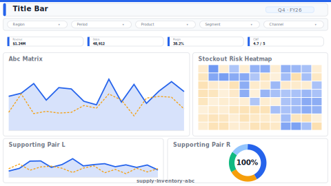

# Inventory ABC Analysis

> **Preview:**  · variants: [annotated](../../assets/layout-previews/supply-inventory-abc-annotated.svg) · [dark](../../assets/layout-previews/supply-inventory-abc-dark.svg)

- Canvas: `1664×936` (landscape-16x9)
- Style: `analytical` · Domain: `supply-chain`
- Visuals: 8
- Zones: `title-bar, slicer-row, turns-ratio-kpis, abc-matrix, stockout-risk-heatmap, supporting-pair`

## Use when
Inventory classification + turns + stockout risk for SKU portfolio

## Avoid when
Make-to-order businesses where stock levels aren't held centrally

## Recommended themes
`supply-chain-logistics`, `manufacturing-ops`, `consulting-authority`

## Chart patterns
`matrix-heat`, `kpi-card-with-spark`, `ranking-bar`

## Data requirements
- min_rows: 500
- required_measures: `turns`, `stockout_pct`
- required_dimensions: `sku`, `warehouse`
- date_grain: `week`

See `layouts-index.json` for full machine-readable entry including `zones_detail[]`.
