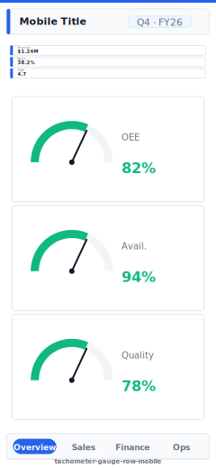

# Tachometer Gauge Row (Mobile)

> **Preview:**  · variants: [annotated](../../assets/layout-previews/tachometer-gauge-row-mobile-annotated.svg) · [dark](../../assets/layout-previews/tachometer-gauge-row-mobile-dark.svg)

> **Derived layout** — Mobile portrait variant of [`tachometer-gauge-row`](./tachometer-gauge-row.md).

- Canvas: `390×844` (mobile-portrait)
- Visuals: 6
- Zones: `mobile-title, mobile-kpi-stack, mobile-hero, mobile-nav-tabs`
- Use when: Mobile / phone variant of `tachometer-gauge-row`. Same insight, stacked single-column layout.
- Avoid when: Desktop screens — prefer the parent landscape layout.

See the base recipe [`tachometer-gauge-row.md`](./tachometer-gauge-row.md) for the full narrative. This variant inherits intent and data requirements; it differs only in canvas, zone stacking, and visual density. Recommended themes, interaction model, and data requirements are documented in `layouts-index.json` under `id: tachometer-gauge-row-mobile`.
