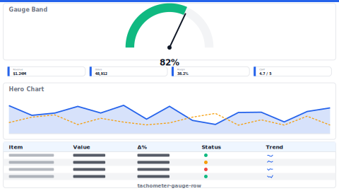

# Layout: Tachometer Gauge Row

> **Preview:** [](../../assets/layout-previews/tachometer-gauge-row.svg) · variants: [annotated](../../assets/layout-previews/tachometer-gauge-row-annotated.svg) · [dark](../../assets/layout-previews/tachometer-gauge-row-dark.svg)

- **id:** `tachometer-gauge-row`
- **Canvas:** 1664 × 936
- **Style personality:** Operational — Top band of 3–4 tachometer gauges (target arc + needle) + KPI cards + map below
- **Audience:** Ops managers, logistics supervisors monitoring KPI-vs-target status
- **Visual count:** 11 — reflow-enhanced (was 9)
- **Pairs with themes:** neutral body with one accent — pattern designed to read on any corporate palette.
- **Observed in:** `references-pbip/SCM - LOGISTICS DEMO.Report/` — 'LOGISTICS OVERVIEW' (3× Tachometer visuals at y=0, h≈170)

---

## Zone map

```
┌────────────────────────────────────────────────────────────────┐ 0
│ Thin title band                                                │ 52
├──────────────┬───────────────┬───────────────┬─────────────────┤
│              │               │               │                 │
│  ◠ GAUGE 1   │   ◠ GAUGE 2   │   ◠ GAUGE 3   │   ◠ GAUGE 4     │ 221
│              │               │               │                 │
├──────────────┴───────────────┴───────────────┴─────────────────┤
│ KPI card row · 4 small cards                                   │ 104
├────────────────────────────────┬───────────────────────────────┤
│                                │                               │
│    MAP / region bars            │    Trend line (YTD)          │ 390
│                                │                               │
├────────────────────────────────┴───────────────────────────────┤
│ Bottom detail table (top-10 routes / lanes)                    │ 169
└────────────────────────────────────────────────────────────────┘
```

---

## Slot specifications

| Slot | x | y | w | h | Visual type | Notes |
|---|---|---|---|---|---|---|
| Title band | 0 | 0 | 1664 | 52 | textbox + shape | Report title + period slicer |
| Gauge 1–4 | 21 | 62 | 1622 | 221 | customVisual(Tachometer) × 4 | Each ~310w × 170h, min-max-target bound measures |
| KPI card row | 21 | 294 | 1622 | 94 | card × 4–5 | Small cards: raw values supporting gauges |
| Map / region bars | 21 | 398 | 806 | 364 | azureMap or barChart by region | Geography overview |
| Trend line | 837 | 398 | 806 | 364 | lineChart | YTD trend of primary KPI |
| Detail table | 21 | 772 | 1622 | 143 | tableEx or matrix | Top routes / facilities by volume |

Gutters: 16px between primary zones; 8px inside KPI card rows.

---

## Navigation

- Reachable from the report's top-nav chiclet strip or landing page. Include a small 'Home' actionButton in the header when not the landing page.
- Cross-links out to related drillthrough / detail pages should be surfaced via card-level actions, not a separate nav rail.

---

## Theme + iconography guidance

- **Palette:** Gauge arcs: red→amber→green for below-target / on-target / above-target. Rest neutral.
- **Logo:** Title band top-left at (16, 8) max height 24px.
- **Icons:** One glyph above each gauge (truck, box, plane, ship) — 20px max.
- **Fonts:** Gauge centre value 22pt, label 10pt. KPI card value 16pt.

---

## When NOT to use this layout

- ❌ KPI has no clear target (gauges are meaningless without one)
- ❌ More than 5 primary KPIs (gauge band becomes crowded — use `scorecard-kpi-grid`)
- ❌ Audience wants trend over status — use `sales-performance` or trend-oriented layout

---

## Customization allowed

- Swap the map for a column chart by lane / region
- Reduce to 3 gauges if fewer KPIs — widen each to ~400w

## Customization NOT allowed

- Using tachometer visual without sufficient color-blind / non-visual annotation (add a text delta under each)
- Stacking two gauge rows — defeats the 'quick glance' purpose

---

## Reflow additions (v0.6)

Gauges show *status now* but not *trajectory*. A **target/threshold legend panel** on the right clarifies what each band means (red/amber/green thresholds), and a **period-comparison ticker** in the title band shows whether today is better/worse than yesterday for each gauge.

### Integration

Shrink the gauge row from `w=1622` to `w=1340` (each of 4 gauges from ~310w to ~255w — still readable). Legend panel at `x=1370, y=62, w=273, h=221`. Period ticker at `x=1020, y=8, w=623, h=36` inside the title band.

### New slots

| Slot | x | y | w | h | Visual type | Notes |
|---|---|---|---|---|---|---|
| Period-comparison ticker | 1020 | 8 | 623 | 36 | multiRowCard | 4 mini-cards: ΔvYesterday per gauge; directional arrow |
| Threshold legend panel | 1370 | 62 | 273 | 221 | tableEx (compact) + shape | Red / Amber / Green threshold bands with numeric bounds; non-interactive |

