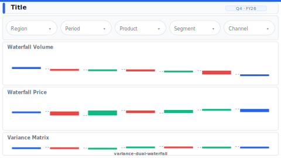

# Layout: Variance Dual Waterfall

> **Preview:** [](../../assets/layout-previews/variance-dual-waterfall.svg) · variants: [annotated](../../assets/layout-previews/variance-dual-waterfall-annotated.svg) · [dark](../../assets/layout-previews/variance-dual-waterfall-dark.svg)

- **id:** `variance-dual-waterfall`
- **Canvas:** 1664 × 936
- **Style personality:** Analytical — side-by-side decomposition
- **Audience:** Finance controllers, FP&A, business review
- **Visual count:** 7 (2 waterfalls + 2 slicers + 1 matrix) — reflow-enhanced (was 5)
- **Pairs with themes:** neutral with 2 semantic colours (favourable/unfavourable)
- **Observed in:** `references-pbip/Financial Dashboard Demo (FMCG) (Eng ver).Report/` — "GM Variance Analysis YTD by Product"

---

## Zone map

```
┌────────────────────────────────────────────────────────────────┐ 0
│ Title: "GM variance — YTD {Period}"                           │ 73
├────────────────────────────────────────────────────────────────┤
│ Slicer: Period      Slicer: Business unit                     │ 62
├──────────────────────────────┬─────────────────────────────────┤
│                              │                                 │
│   Waterfall A (Volume)       │   Waterfall B (Price / Mix)    │ 364
│                              │                                 │
├──────────────────────────────┴─────────────────────────────────┤
│                                                                │
│   Variance matrix (full width, sortable)                      │ 364
│                                                                │
└────────────────────────────────────────────────────────────────┘ 936
```

---

## Slot specifications

| Slot | x | y | w | h | Visual type | Notes |
|---|---|---|---|---|---|---|
| Title | 31 | 21 | 1602 | 42 | textbox | 22pt Semibold |
| Slicer: Period | 31 | 73 | 390 | 52 | slicer (tile) | MTD / QTD / YTD |
| Slicer: Segment | 442 | 73 | 390 | 52 | slicer (dropdown) | |
| Waterfall A | 31 | 146 | 790 | 374 | waterfallChart | Volume variance vs plan |
| Waterfall B | 842 | 146 | 790 | 374 | waterfallChart | Price / mix variance vs plan |
| Variance matrix | 31 | 541 | 1602 | 374 | pivotTable | Rows=product, cols=components, total rightmost |

Gutters: 16px between waterfalls, 16px between waterfall row and matrix. Legend pinned inside each waterfall at top-right.

---

## Navigation

Single-page. If launched from exec page, include "← Back" actionButton at `(24, 16)` and shift title to x=76.

---

## Theme + iconography guidance

- **Palette:** 1 favourable colour (typically green / positive accent), 1 unfavourable (red / warning). Neutral grey for "subtotal" bars. NO other hues.
- **Logo:** Optional — omit unless the deck demands branding. If included, place at `(24, 16)`, max height 24px, and shift title to x=76.
- **Icons:** none inside waterfalls (colour is the signal); matrix can use tiny triangle up/down glyphs in variance columns.
- **Fonts:** waterfall category labels 10pt rotated 0° (keep horizontal) — if categories overflow, reduce to 8 per waterfall and move rest to matrix.

---

## When NOT to use this layout

- ❌ Only one variance dimension to decompose — use `finance-pnl-waterfall` instead
- ❌ Audience needs narrative — waterfalls demand context the layout doesn't provide; pair with a text commentary page
- ❌ More than ~10 bars per waterfall — cluttered, switch to a ranked-bar + matrix layout
- ❌ No matrix backing data available — the layout's third row becomes filler

---

## Customization allowed

- Replace matrix with a dual horizontal-bar ranking (top/bottom contributors)
- Stack waterfalls vertically if a deeper decomposition is needed (each 608→1232 wide, 140h)
- Swap slicer pair for a single report-level date range

## Customization NOT allowed

- Using 3 waterfalls in the same row (each compresses below readable bar width)
- Removing the matrix if waterfalls reference items shown only there (breaks audit trail)

---

## Reflow additions (v0.6)

Dual waterfalls explain *what* moved but not *how much net*. Add a **Net Δ KPI card** in the slicer row as the page's anchor number, plus a **Top-drivers insight panel** beside the matrix for the 3 largest bar contributors in prose form.

### Integration

Shrink **Variance matrix** from `w=1602` to `w=1260` (loses the rightmost total column — acceptable, the total is still carried by the Net Δ card). Insight panel sits at `x=1311–1633`.

### New slots

| Slot | x | y | w | h | Visual type | Notes |
|---|---|---|---|---|---|---|
| Net variance KPI | 853 | 73 | 390 | 52 | card | Total Δ vs plan with directional arrow; 20pt value |
| Top-drivers insight | 1311 | 541 | 322 | 374 | multiRowCard + textbox | Top-3 drivers: name + Δ + 1-line narrative each |

