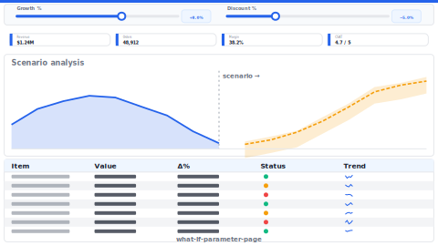

# Layout: What-If Parameter Page

> **Preview:** [](../../assets/layout-previews/what-if-parameter-page.svg) · variants: [annotated](../../assets/layout-previews/what-if-parameter-page-annotated.svg) · [dark](../../assets/layout-previews/what-if-parameter-page-dark.svg)

- **id:** `what-if-parameter-page`
- **Canvas:** 1664 × 936
- **Style personality:** Analytical — Parameter-slider strip at top + scenario KPI cards + response chart + comparison table
- **Audience:** Planners, commercial analysts, anyone modelling scenarios
- **Visual count:** 10
- **Pairs with themes:** neutral body with one accent — pattern designed to read on any corporate palette.
- **Observed in:** `references-pbip/Sales Analysis - IMP Demo.Report/` — 'WHAT-IF ANALYSIS' (43 visuals, outspacePane)

---

## Zone map

```
┌────────────────────────────────────────────────────────────────┐ 0
│ Header + reset-scenario button                                 │ 73
├────────────────────────────────────────────────────────────────┤
│ PARAMETER STRIP · 3-4 numeric sliders + assumptions chips      │ 130
├──────────────────┬─────────────────┬───────────────────────────┤
│                  │                 │                           │
│  KPI Base        │  KPI Scenario   │   Δ vs. Base              │ 143
│                  │                 │                           │
├──────────────────┴─────────────────┴───────────────────────────┤
│                                                                │
│   SCENARIO RESPONSE CHART (Base vs. Scenario line)             │ 312
│                                                                │
├────────────────────────────────────────────────────────────────┤
│ Comparison table: line-item · Base · Scenario · Δ · Δ%         │ 278
└────────────────────────────────────────────────────────────────┘
```

---

## Slot specifications

| Slot | x | y | w | h | Visual type | Notes |
|---|---|---|---|---|---|---|
| Header | 0 | 0 | 1664 | 73 | shape + textbox + actionButton(Reset) | Title + reset scenario |
| Parameter strip | 0 | 73 | 1664 | 130 | numericRangeSlicer × 3 + textbox(assumptions) | 3-4 whatIf parameters |
| KPI Base | 21 | 213 | 530 | 143 | card | Base scenario value |
| KPI Scenario | 567 | 213 | 530 | 143 | card | What-If scenario value |
| KPI Delta | 1113 | 213 | 530 | 143 | card | Δ and Δ% |
| Scenario chart | 21 | 367 | 1622 | 312 | lineChart (2 series: Base, Scenario) | Time-series comparison |
| Comparison table | 21 | 689 | 1622 | 239 | matrix | Line-item breakdown: Base, Scenario, Δ, Δ% |

Gutters: 16px between primary zones; 8px inside KPI card rows.

---

## Navigation

- Reachable from the report's top-nav chiclet strip or landing page. Include a small 'Home' actionButton in the header when not the landing page.
- Cross-links out to related drillthrough / detail pages should be surfaced via card-level actions, not a separate nav rail.

---

## Theme + iconography guidance

- **Palette:** Base series neutral grey; scenario series uses the accent. No other colours compete.
- **Logo:** Header top-left at (16, 16) max height 24px.
- **Icons:** Slider glyph at the parameter-strip left edge.
- **Fonts:** Header 16pt, KPI value 26pt, slider labels 10pt.

---

## When NOT to use this layout

- ❌ Model has no What-If parameters defined — the page can't function
- ❌ Audience is executive (reading only) — a pre-computed scenario comparison on `scorecard-kpi-grid` is enough
- ❌ Scenario count > 3 — consider a parameter table + small-multiples page instead

---

## Customization allowed

- Add a bookmark strip with 3 preset scenarios (Base / Upside / Downside)
- Replace scenario chart with stacked bars if the breakdown matters more than the time series

## Customization NOT allowed

- Hiding the parameter strip (users won't realise the page is interactive)
- Binding parameters to measures that also drive other pages (cross-page scenario pollution)
