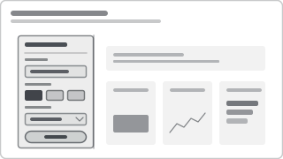

# Recipe: Left-Rail Global Slicer Panel

> **Preview:** [](../../assets/slicer-previews/left-rail-global-panel.svg)

- **id:** `left-rail-global-panel`
- **Family:** architecture
- **Control type:** slicer group + container
- **Cardinality:** n/a (wraps 3–5 slicer recipes)
- **Typical footprint:** 240 × 720 (full-height, 16:9 canvas)

---

## Composition

```
┌──────────┬───────────────────────────────────────────┐
│ FILTERS  │                                           │
│ ─────────│                                           │
│ Date     │                                           │
│ Last 12M │                                           │
│          │        PAGE CONTENT                       │
│ Region   │                                           │
│ ▾ All    │                                           │
│          │                                           │
│ Channel  │                                           │
│ [MT][GT] │                                           │
│ [E-com]  │                                           │
│          │                                           │
│ Brand    │                                           │
│ ▾ All    │                                           │
│          │                                           │
│ [ Reset ]│                                           │
└──────────┴───────────────────────────────────────────┘
```

Fixed width rail (220–260 px); contains a sync-group set of slicers plus a Reset button.

---

## Slots & Bindings

| Slot | Recipe |
|---|---|
| Rail header | Text box: "Filters" + optional info icon |
| Slot 1 | `date-relative-rolling` or `date-between-slider` |
| Slot 2 | `chiclet-tile-slicer` (low-card primary dim) |
| Slot 3 | `dropdown-search-slicer` or `hierarchy-slicer` |
| Slot 4 (optional) | Secondary dropdown |
| Footer | Reset button (bookmark → default state) |

All slicers in the rail should share the same sync group (see `sync-slicer-group`).

---

## Structural Properties

```json
{
  "name": "filter-rail",
  "type": "shape",
  "position": { "x": 0, "y": 0, "z": 0, "width": 240, "height": 720 },
  "visual": { "fill": "background2", "border": "neutralBorder" }
}
```

- **Background:** `background2` (subtle contrast from canvas)
- **Border:** 1 px right border only (`neutralBorder`)
- **Slicer spacing:** 16 px vertical gap
- **Reset button:** pinned to bottom, invokes a "default-state" bookmark

---

## Defaults

| Setting | Default | Why |
|---|---|---|
| Collapse behavior | Not collapsible (it's the architecture) | Use `top-header-filter-bar` instead if space is tight |
| Sync group | `analysis` (or domain-specific) | State persists on page change |
| Reset | Bookmark to default-state | Single click, no pane drill |

---

## Anti-patterns

❌ Left rail on a 1-page executive dashboard — wastes canvas; use `top-header-filter-bar`.
❌ Left rail on mobile portrait — eats > 50% width.
❌ Rail with only 1 slicer — doesn't justify the architecture.
❌ Rail without a Reset — 5 slicers are hard to reset manually.

---

## Pairs well with

- `sync-slicer-group` (always)
- `left-rail-filter-analytical` layout
- `landing-navigation` layout — rail appears on child pages

---

## Mobile fallback

Hide the rail; expose the same fields via the collapsed filter pane OR a `top-header-filter-bar` in the mobile layout.
