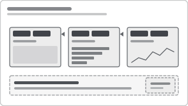

# Recipe: Sync-Slicer Group (Narrative Continuity)

> **Preview:** [](../../assets/slicer-previews/sync-slicer-group.svg)

- **id:** `sync-slicer-group`
- **Family:** architecture
- **Control type:** sync group (cross-page state)
- **Cardinality:** n/a
- **Scope:** sync-group (defined set of pages)

---

## Composition

```
Page: Overview          Page: Analysis        Page: Brand Deep-dive
┌────────────────┐      ┌────────────────┐    ┌────────────────┐
│ Date: Last 12M │◄────►│ Date: Last 12M │◄──►│ Date: Last 12M │
│ Channel: MT    │      │ Channel: MT    │    │ Channel: MT    │
│                │      │                │    │                │
│  KPIs · Trend  │      │  Ranked Bars   │    │ Brand detail   │
└────────────────┘      └────────────────┘    └────────────────┘
                 sync group: "analysis"

Page: Detail (drillthrough)       Page: Tooltip
┌────────────────┐                ┌────────────────┐
│ (brand, month) │                │ (hover-context)│
│  NOT synced    │                │  NOT synced    │
└────────────────┘                └────────────────┘
```

A named set of pages share slicer state. Changing Date on Overview updates Analysis and Brand. Detail and Tooltip pages receive their own context and are deliberately **excluded** from the sync group.

---

## Sync Group Design

| Group name | Member pages | Members of which slicers |
|---|---|---|
| `analysis` | Overview, Trade ROI, Brand Deep-dive, Promotion | Date, Channel, Region, Brand |
| `finance-sync` | P&L Overview, Variance, Forecast | Date, Entity, Currency |
| `ops-floor` | Line Status, Throughput, Downtime | Shift, Line |

Drillthrough / tooltip pages → **never** in a sync group (they carry their own context).

---

## Implementation (conceptual)

In Power BI Desktop: **View → Sync slicers** → enable "Sync" and "Visible" per slicer × page matrix.

In PBIR JSON, each slicer has a `syncGroupName`:
```json
{
  "visualType": "slicer",
  "syncGroups": [{ "groupName": "analysis", "fieldChanges": true, "filterChanges": true }]
}
```

---

## Defaults

| Setting | Default | Why |
|---|---|---|
| Group naming | lowercase-kebab (`analysis`, `finance-sync`) | Searchable, consistent |
| Visibility per page | Visible only on canvas pages that need the slicer | Keep detail pages clean |
| Mobile parity | ON (same group, same members) | Unless the mobile narrative branches |

---

## Anti-patterns

❌ Single global group covering all pages — breaks drillthrough context.
❌ Slicer in sync group but not visible anywhere — users can't change it; becomes a ghost filter.
❌ Different sync groups with overlapping fields on the same page — last-writer-wins chaos.
❌ Sync groups on tooltip pages — tooltip is supposed to reflect hover context.

---

## Decision rule

```
Does Page B expect to inherit Page A's slicer state?
├── Yes, seamlessly                → Same sync group
├── Yes, but only sometimes        → Separate groups; add Reset button
├── No, it receives its own context → Exclude from sync group (drillthrough/tooltip)
```

---

## Pairs well with

- `left-rail-global-panel` (rail slicers are always synced across analysis pages)
- `top-header-filter-bar` (header bar synced on all executive pages)
- `role-based-bookmark` — bookmarks can redirect the sync group's default values
